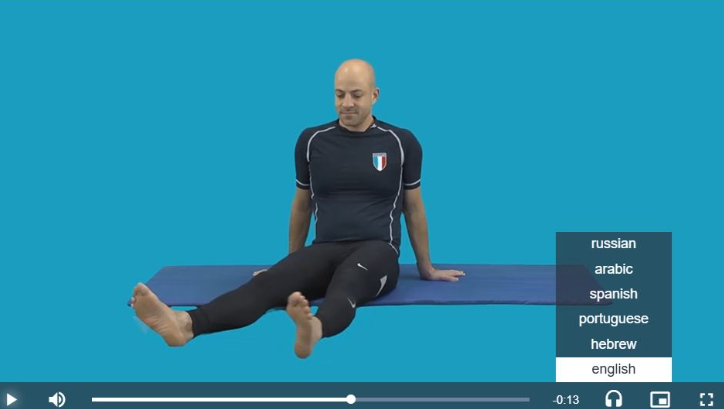

# WizeCare Video Translation Pipeline

WizeCare is an AI-assisted multimedia localization pipeline for physiotherapy
videos. It combines speech transcription, multilingual translation, language
review, neural text-to-speech, and adaptive HLS packaging into a browser-ready
delivery workflow.

## What It Does

```text
Video
  -> FFmpeg audio extraction
  -> WhisperX transcription
  -> Ollama/LLaMA cleanup
  -> NLLB multilingual translation
  -> LLaMA review and correction
  -> timestamp alignment
  -> Azure Speech TTS
  -> multilingual audio tracks
  -> multi-bitrate HLS packaging
  -> browser playback
```

## Demo



*Multilingual video playback with selectable localized audio tracks.*

## Engineering Highlights

- Python orchestration across transcription, translation, TTS, and packaging
- Node.js and FFmpeg media extraction
- WhisperX speech-to-text with timestamped segments
- Hugging Face NLLB-200 multilingual translation
- Ollama/LLaMA cleanup, review, and correction stages
- Azure Speech neural voices with timestamp-aware audio rendering
- HLS audio plus four video renditions: 1080p, 720p, 480p, and 240p
- Environment-backed paths and credentials
- Collision-aware file handoffs and opt-in destructive cleanup

## Architecture

```mermaid
flowchart LR
    A[Input video] --> B[run_two_scripts_and_move.py]
    B --> C[run_pipeline.py]
    C --> D[Node + FFmpeg audio extraction]
    D --> E[WhisperX transcription]
    E --> F[Ollama/LLaMA cleanup]
    F --> G[NLLB translation]
    G --> H[LLaMA review and auto-fix]
    H --> I[Timestamp alignment]
    I --> J[Azure Speech TTS]
    J --> K[run_full_hls_pipeline.py]
    K --> L[HLS audio and video playlists]
    L --> M[Video.js browser player]
```



## Canonical Entry Point

Run the orchestration script from the repository root:

```powershell
.venv\Scripts\python.exe run_two_scripts_and_move.py
```

The runner invokes `translateSteps/run_pipeline.py`, transfers the generated
audio/video handoff files, and invokes `Become_Video/run_full_hls_pipeline.py`.
The normal input folders are `translateSteps/videos` and `translateSteps/HebVideo`.
The English and Hebrew filenames must contain the same first numeric identifier
for the matching stage to accept them.

## Supported Languages

The configured/demo languages are English, Hebrew, Russian, Spanish, Arabic,
and Portuguese.

## Project Structure

```text
run_two_scripts_and_move.py       # Canonical orchestrator
translateSteps/                   # Transcription, translation, review, and TTS
Become_Video/                     # Audio/video conversion and HLS packaging
docs/                             # Architecture and operational documentation
tests/smoke_test.py               # Dependency-light wiring smoke test
```

## Setup

The documented baseline uses Python 3.10, Node.js 18+, FFmpeg, and Ollama.
Full execution also requires large local AI models, compatible Python packages,
and Azure Speech credentials. Copy `translateSteps/.env.example` to an ignored
local `.env` and provide credentials there; never commit secret values.

## Current Validation Status

- Repository configuration and Python/Node syntax checks pass.
- Configuration overrides and non-AI timestamp construction pass.
- Node/FFmpeg audio extraction was validated with an approved demo-video copy.
- Historical project documentation records successful full pipeline execution.
- A fresh full AI run has not been revalidated in the cleaned environment; model
  runtime restoration remains incomplete.

## Historical Result

The historical implementation produced multilingual translations, Azure-generated
localized WAV tracks, HLS audio playlists, four HLS video qualities, and packaged
browser-player output. Those results are historical evidence, not a claim of a
fresh clean-environment end-to-end run.

## Security

Credentials are environment-based. `.env` files, local models, caches, generated
media, and vendor material are excluded by `.gitignore`; `.env.example` contains
placeholders only. Credentials and private endpoints do not belong in Git.

## Portfolio Note

This repository presents the WizeCare localization pipeline as an engineering
case study, emphasizing staged media processing, model integration, timing
preservation, and streaming delivery.
