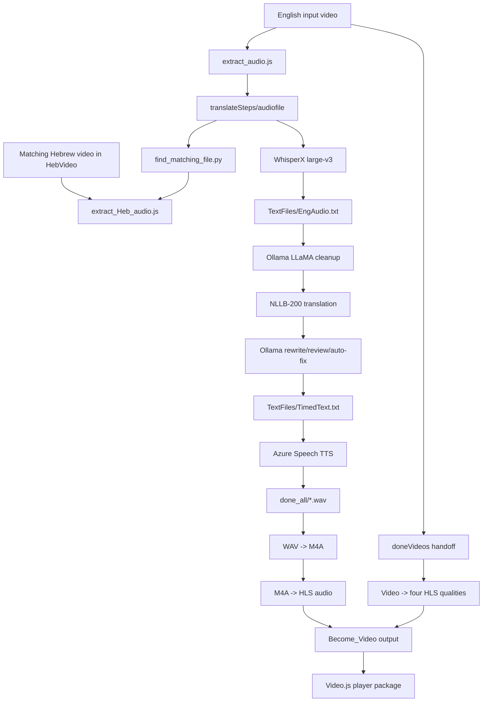

# WizeCare Architecture

## System boundary

The canonical system is a local orchestration pipeline. Python coordinates model
and file stages, Node.js starts FFmpeg for initial audio extraction, Azure Speech
provides neural TTS, Ollama provides local LLaMA refinement, and the final HLS
utilities create browser-deliverable playlists and segments.



## Responsibilities

### Orchestration

`run_two_scripts_and_move.py` launches the translation pipeline with the active
Python interpreter, transfers processed videos and WAV files, then launches the
HLS pipeline. Its move helper refuses to overwrite existing destinations.

### Translation pipeline

`translateSteps/run_pipeline.py` performs the following sequence:

1. Run `extract_audio.js`.
2. Require a numeric match in `HebVideo` and run `extract_Heb_audio.js`.
3. Transcribe the newest English audio with `audio_transcriber.py`.
4. Clean the transcription with `llama_cleaner.py`.
5. Translate with NLLB in `text_translator.py`.
6. Refine, review, and auto-fix with `llama3_Run.py` and `auto_fix_translation.py`.
7. Align translated text with `build_timed_script.py`.
8. Render timestamped Azure Speech audio with `azure_tts.py`.

### Configuration

`pipeline_config.py` resolves default folders relative to `translateSteps` and
supports environment overrides for input, output, language, run mode, and video
count. Azure settings are loaded by `azure_tts.py` from the ignored local `.env`.

## File movement

```text
translateSteps/videos       -> translateSteps/doneVideos
translateSteps/audiofile   -> translateSteps/audioDone
translateSteps/HebVideo     -> translateSteps/doneHeb
translateSteps/done_all     -> Become_Video/WAV
Become_Video/WAV            -> Become_Video/wavdone
Become_Video/mp4a           -> Become_Video/done_m4a
Become_Video/doneVideos     -> Become_Video/finiseVideo
```

`EngAudio.txt` and `TimedText.txt` are written under `translateSteps/TextFiles`.
The timestamp mapping stage overwrites `TimedText.txt`; existing TTS output names
and orchestrator destinations are protected by collision checks.

## HLS structure

The HLS utilities create audio playlists under `audio_<language>/` and four video
quality directories:

```text
Become_Video/
  audio_en/audio_en_high.m3u8
  audio_<language>/audio_<language>_high.m3u8
  high/index.m3u8       # 1080p
  medium/index.m3u8     # 720p
  low/index.m3u8        # 480p
  verylow/index.m3u8    # 240p
  index.m3u8             # generated video master playlist
```

Each HLS conversion can remove prior matching playlists/segments and uses FFmpeg
overwrite behavior. Cleanup is separately opt-in through `WIZECARE_CLEANUP=1`.

## External systems and models

- FFmpeg: media conversion and HLS segment generation
- WhisperX/PyTorch: local transcription
- Hugging Face NLLB-200: local translation model
- Ollama `llama3:instruct`: local cleanup/review/correction
- Azure Speech: neural TTS service
- Video.js CDN assets: browser-player presentation
